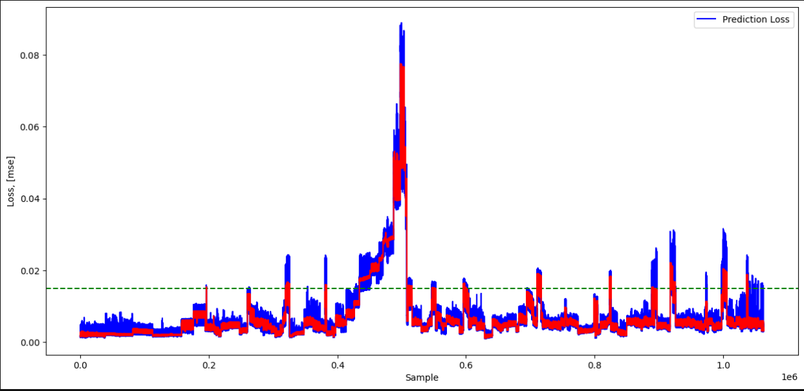
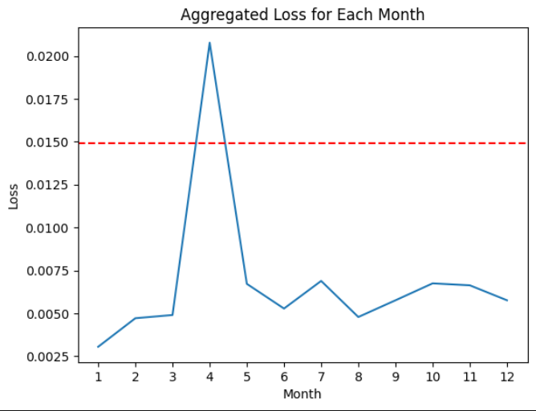
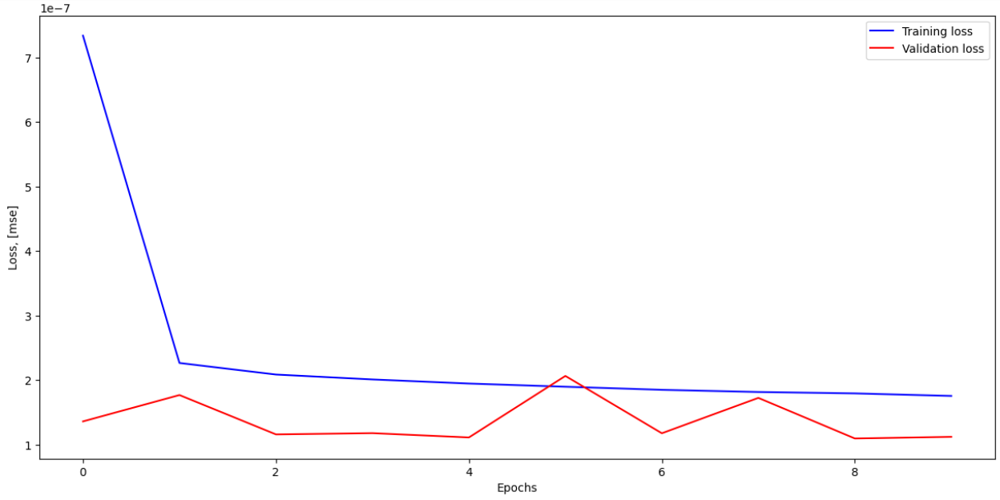
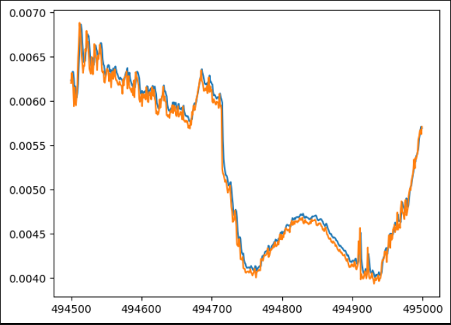
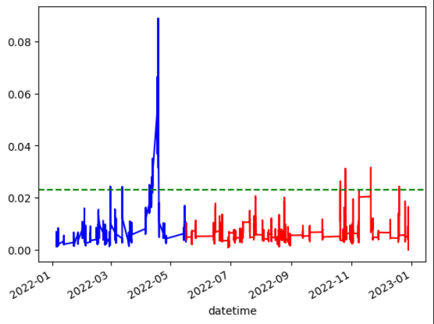
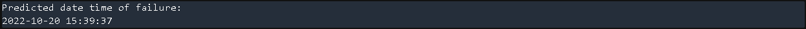
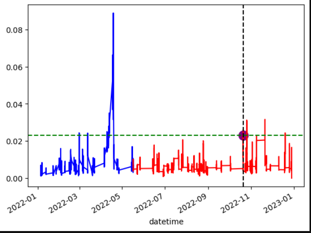

# Deep learning For Process Monitoring and Fault Diagnosis:

## Fault/Anomaly Detection: 

The goal was to identify anomalies in our data points, having access to that information on our data can give insights on the usual time frames where there would be occurences of such faults. 

### Approach: 
I bundled the 519 files to give an "Organized_Dataset", since our data is time series data, we chose a portion of that data which is the healthy state to train the model.

#### Date Preprocessing
```python
# Data preprocessing ;
X = main_df


scaler = preprocessing.MinMaxScaler()

X = pd.DataFrame(scaler.fit_transform(X),
                    columns=main_df.columns,
                    index = main_df.index)

train_percent = 0.15
train_size = int(len(main_df)*train_percent)
X_train = X[:train_size]
```

The model i chose was an auto encoder neural network. it's objective was to reconstruct data, and record the error given in each instance reconstruction in a dataframe so we can plot it to see which instances give the biggest error ie: anomalies
```python
# Model building ; 

seed(10)

#activation function ;

act_function = "elu"

# Model Layers ; 

autoencoder = keras.Sequential([
    layers.Dense(128, activation=act_function, input_shape=(X_train.shape[1],)),
    layers.Dense(64, activation=act_function,),
    layers.Dense(8, activation=act_function,),
    layers.Dense(64, activation=act_function,),
    layers.Dense(128, activation=act_function,),
    layers.Dense(X_train.shape[1], activation=act_function)
])

# Compiling the module ; 

autoencoder.compile(optimizer = "adam", loss = "mse") 

# training the model and setting the validation loss and training loss into a variable called eval; 

eval = autoencoder.fit(np.array(X_train),np.array(X_train),
              epochs = 100 ,
              batch_size = 200 ,
              verbose = 1,
              validation_split=0.1)
```

The Hyper Parameteres were chosen through trial and error, since i already had an idea of how the machine would behave, through it's lifespan cosntrictions. I proceeded to use that as a basis to choose which reconsutruction was the most "Realistic".

### Recording and Visulization: 
I recorded the error of each reconstruction in a Dataset, and then plotted that error to it's progression throughout the year.   
```python

#Reconstructing full data
X_pred = autoencoder.predict(np.array(X))
X_pred = pd.DataFrame(X_pred,columns=main_df.columns)
X_pred.index = pd.DataFrame(X).index

#Returning mean of the losses for each column and putting it in a dataframe
scored = pd.DataFrame(index=pd.DataFrame(X).index)
scored['Loss_mae'] = np.mean(np.abs(X_pred-X), axis = 1)

#Threhhold value of error;
threshold = np.mean(scored['Loss_mae']) + np.std(scored['Loss_mae'])
print("Thershold: ", threshold)

#Plot size
plt.subplots(figsize=(15,7))


#Saving dataframe
scored.to_csv('AutoEncoder_loss.csv')

#Plot
plt.plot(scored['Loss_mae'],'b',label='Prediction Loss')

plt.legend(loc='upper right')
plt.xlabel('Sample')
plt.ylabel('Loss, [mse]')

#Threshold line
plt.axhline(y=threshold, color='g', linestyle='--')

# Moving mean : 
plt.plot(scored.index, scored['Loss_mae'].rolling(100).mean(), 'r', markersize=1, label = 'Moving Mean')
```

As you can see from the following that the Plot clearly shows states where the error spikes up, its evident that that the machine is having trouble coming back or reaching to it's designated "healthy state" coordinates when it runs for a few months.




I used a moving mean to smooth out some noise in the plot. It becomes slightly more readable this way. In addition there's also the threshold value of error, which is chosen through the summation the MEAN error  and two STD DEVIATONS. We use it to destinguish anomalies from normal states.

### Analysis:

To identify the periods of time where we the error spikes, we created added a dataframe for Months. In order to see clearly when exactly the most spikes happen. 

#### Creating the Month Column:

```python
# making Month Dataframe
month_use = pd.read_csv("Organized_Dataset.csv")
months = pd.DataFrame(month_use["Month"],
                        index=month_use.index)
months.columns= ["Month"]
#adding it to loss Dataframe; 
scored = pd.concat([scored, months], axis=1)
```
#### Plotting Error vs Month

```python
# Group by 'Month' and calculate the mean loss for each month
monthly_loss = scored.groupby('Month')['Loss_mae'].mean()

# Plotting the aggregated loss values for each month
plt.plot(monthly_loss.index, monthly_loss.values)
plt.title("Aggregated Loss for Each Month")
plt.xlabel("Month")
plt.ylabel("Loss")
plt.xticks(monthly_loss.index)
plt.axhline(y=threshold, color='r', linestyle='--')
plt.show()
```
#### Plot: 



As we can see Month 4 is the month where the machine evidently fails. it also shows relatively normal states after. The only explanation that the blades were actually replaced at that time due to the prior failure.
It also is worthy to note that the error is gradually increasing by Month 10 and 11. That signifies that the blades do indeed wear out after 4 to 6 months of use.

#### For more information the code file has all the details.

## Fault/Anomaly Prediction: 

For reference we saved the loss of the Auto Encoder in csv file. in this second part we plan to use an LTSM (RNN) to learn the pattern for the Autoencoder loss, and to use it to predict future error while the machine is still working. the objective is to estimate a time to failure when the predicted error hits the prior threshold.

First, to be able to pinpoint a failure date, we need a date_time index for our error dataframe.

```python
scored = pd.read_csv("AutoEncoder_loss.csv")
main_df = pd.read_csv("Organized_Dataset.csv")
main_df["Year"] = 2022
datetime_str = main_df ['Year'].astype(str) + '-' + main_df ['Month'].astype(str) + '-' + main_df ['Day'].astype(str) + ' ' + main_df ['Hour'].astype(str) + '-' + main_df ['Minute'].astype(str) + '-' + main_df ['Second'].astype(str)

# Transforming our error data set index into date time format for time series forecasting of error using LSTM RNN : 

scored['datetime'] = pd.to_datetime(datetime_str, format='%Y-%m-%d %H-%M-%S',errors='coerce')
scored = scored.drop(["Unnamed: 0"],axis=1)

# setting the datetime column as index:
scored.set_index('datetime', inplace=True)
scored
```
#### Suiting the data for the LSTM Neural Network:

```python
# Making a function that converts our data in a manner suitable for LSTM usage : [x1,x2,x3,x4,x5] [Y]
temp = scored["Loss_mae"]
def df_to_X_y(df, window_size=5):
  df_as_np = df.to_numpy()
  X = []
  y = []
  for i in range(len(df_as_np)-window_size):
    row = [a for a in df_as_np[i:i+window_size]]
    X.append(row)
    label = df_as_np[i+window_size]
    y.append(label)
  return np.array(X), np.array(y)
WINDOW_SIZE = 5
X,y = df_to_X_y(temp, WINDOW_SIZE)
X.shape, y.shape
```

The LSTM model takes a window of 5 inputs and learns to predict the 6th one, that's the recurrent aspect of it. it uses predicted outputs to predict future outputs.
#### Splitting the data 
```python
# We split our data into training, validation and testing; we are gonna choose entire first life time for training (First 4 Months)

X_train1, y_train1 = X[:510000], y[:510000]
X_val1, y_val1 = X[510000:560000], y[510000:560000]
X_test1, y_test1 = X[560000:], y[560000:]
X_train1.shape, y_train1.shape, X_val1.shape, y_val1.shape, X_test1.shape, y_test1.shape 
```
### The Model
```python
# Building the LSTM model for time-series forcasting of our error : 

model1 = Sequential()
model1.add(InputLayer((5, 1)))
model1.add(LSTM(128))
model1.add(Dense(64,"relu"))
model1.add(Dense(8, "relu"))
model1.add(Dense(1, "linear"))

# Optimizer:
model1.compile(loss=MeanSquaredError(), optimizer=Adam(learning_rate=0.0001))

# Training:
history = model1.fit(X_train1, y_train1, validation_data=(X_val1, y_val1),batch_size=32, epochs=10 )
```

We levaraged the size of the data, and we used a model with a more architectural complexity (128 untis for first layer) 

### Validation and training losses
```python
plt.subplots(figsize=(15,7))

plt.plot(history.history['loss'],'b',label='Training loss')
plt.plot(history.history['val_loss'],'r',label='Validation loss')
plt.legend(loc='upper right')
plt.xlabel('Epochs')
plt.ylabel('Loss, [mse]')

plt.show()
```

we can see that the model works well with unseen data. through the plot of the validation loss, the error almost goes to zero at the end of the training, with extreme minimal loss. 



the next step is to test the model on the train, validation, and test sets and to record the results in Dataframe to plot for more clearity.
 
 Here we will only be focusing on the test set, since it is unseen data. and we compare it the actual results. 

```python
# Testing the model on testing data:

test_predictions = model1.predict(X_test1).flatten()
test_results = pd.DataFrame(data={'Test Predictions':test_predictions, 'Actuals':y_test1})

# Plotting both actual values of Testing data (orange) and predicted values of Testing data (blue)

plt.plot(test_results['Test Predictions'][494500:495000])
plt.plot(test_results['Actuals'][494500:495000])
```


Here we can see that the plots are pretty identical, signifying the accuracy of the model to predict real world values, to analys and work with. our model is working like we hoped.

we create a column for the predicted values, but since it has the same index of the whole dataset and the "scored" Dataframe, we're filling the rest of the values with the "scored" original error values. that we can plot actual and predicted with different colors. 
```python
# predicting the remaining useful life of the system (RUL):

# First we make a copy dataframe of the loss function, than we add the column of predictions, so it's easier to plot later 
# and also it makes it easier to identify the time of failure when we use tha date time index in the "scored" dataframe we used earlier 

scored_2 = scored.copy()
scored_2["Prediction"] = 0
scored_2["Prediction"][:560000] = scored["Loss_mae"][:560000]
scored_2["Prediction"][560000:560000+502907] = y_test1
scored_2
```

### Plotting 

```python
# Visual representation of the predicted data (red), and actual data(blue)

scored_2["Prediction"][:560000].plot(color="blue")
scored_2["Prediction"][560000:].plot(color="red")
threshold = np.mean(scored['Loss_mae']) + 2 * np.std(scored['Loss_mae'])
plt.axhline(y=threshold, color='g', linestyle='--')
```



as you can see the predictions looks very similiar to the original reconsutruction error plot, which means that our model is working nicely.

we can also add a script to pinpint the exact date time the prdicted error values hit the "threshold value of error", which is the exactly "The Predicted Datet Time of Failure"

```python
# Script to leverage the date time format index to find the RUL, or Date to failure in this case : 

for value in scored_2["Prediction"][560000:]:
    if value >= threshold:
        datetime_prediction = scored_2.index[scored_2['Prediction'] == value][0]
        failure_date = datetime_prediction
        break
print("Predicted date time of failure:" )
print(failure_date)
```


we can also plot it for reference to the other points

```python
# Plotting the given input Blue, and the prediction of error Red 
scored_2["Prediction"][:560000].plot(color="blue")
scored_2["Prediction"][560000:].plot(color="red")

# Plotting threshhold line for visibility of failure : 
threshold = np.mean(scored['Loss_mae']) + 2 * np.std(scored['Loss_mae'])

# Highlighting the point of faliure on our plot : 
plt.axhline(y=threshold, color='g', linestyle='--')
plt.axvline(x=failure_date, color='black', linestyle='--')
plt.scatter(failure_date, threshold, color='purple', marker='o', s=150)
```
