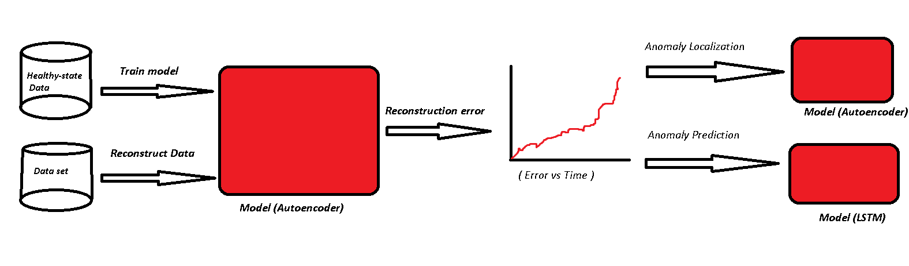

# WATCHDOG

## Introduction

With the rapid advancements in artificial intelligence (AI) technology, there is a growing effort to incorporate AI into industrial processes for process monitoring. By leveraging machine learning algorithms and real-time data analysis, AI-based process monitoring systems can provide valuable insights, predictive capabilities, and automation to enhance overall operational efficiency and quality control.

 ## Objective

 Leveraging Deep Learning to monitor the cutting blades degradation in hopes of increasing the machines reliability and reduce unexpected downtime caused by failed cuts. 

  ## Dataset 
  The 519 files in the dataset are of the format MM-DDTHHMMSS_NUM_modeX.csv, where MM is the month ranging from 1-12 (not calendar month), DD is the day of the month, HHMMSS is the start time of day of recording, NUM is the sample number and X is a mode ranging from 1-8. Each file is a ~8 second sample with a time resolution of 4ms that totals 2048 time-samples for every file.

  The associated dataset shows records of intricate play of various mechanical parts and actions - housed in cutting - unit of OCME’s VegaHT. Each data set has 8 features (variables) and 2048 observations (tuples), besides their columns’ names are also same. Features has been described below : 

- Timestamp - Timestamp (seconds)
- pCut Motor Torque - Torque (nM)
The force that causes Anti-Clock Wise rotation is Positive Torque and the force that causes Clock Wise rotation is Negative Torque.

- pCut CTRL Position controller Lag error - Represent the instantaneous position error between the set-point from the path generator and the real current encoder position of the motor
- pCut CTRL Position controller Actual position - Cutting blade position (mm)
- pCut CTRL Position controller Actual speed - Speed of the cutting blade
- pSvolFilm CTRL Position controller Actual position: Plastic film unwinder position (mm)
- pSvolFilm CTRL Position controller Actual speed - Speed of the plastic film unwinder
pSvolFilm CTRL Position controller Lag error - Represent the instantaneous position error between the set-point from the path generator and the real current encoder position of the motor. 

  ## Process
  .png>)

The Vega shrink-wrapper from OCME is deployed in large production lines in the food and beverage industry. 

The machine groups loose bottles or cans into set package sizes, wraps them in plastic film and then heat-shrinks the plastic film to combine them into a package. 

The plastic film is fed into the machine from large spools and is then cut to the length needed to wrap the film around a pack of goods. 

The cutting assembly is an important component of the machine to meet the high availability target.

 Therefore, the blade needs to be set-up and maintained properly. Furthermore, the blade can not be inspected visually during operation due to the blade being enclosed in a metal housing and its fast rotation speed.
  

## Approach 
The monitoring objective is detection, prediction, and localization of anomalies in the given data. 
and do to achieve that we used : 
1. Autoencoder: We train our model on the healthy state of the data, additionally we reconstruct our entire data set and leverage the reconsutrction error to identify the severity of the anomalies at hand.

2. LSTM (RNN) : we store our error for further use in the form of time-series data, for the objective of predicting the values of error for the future. With a calculated threshold of error, it is possible to determine when the machine is estimated to fail. Because of the time-series nature of data. 

3. Autoencoder: we use the same autoencoder we built to get the reconstruction error of each individual feature in the dataset, which in practice are machine sensors. We can locate the sensor that identifies the anomaly, which is the one with generally the highest error. 

## Closing Notes 

Refer to the "build" folder for the complete process and coding of this project.